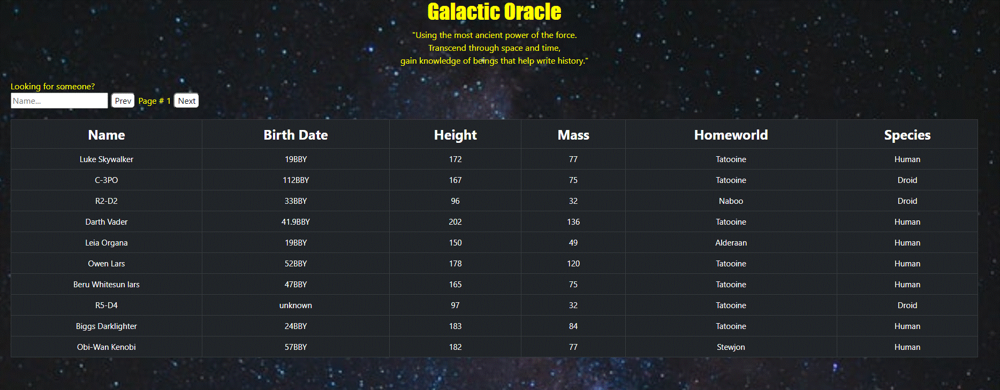

## Welcome to the Galactic Oracle

---

Star Wars application using React, Axios, Bootstraps and deployed to Heroku

Try out the live version [here](https://fritz-star-wars.herokuapp.com/)

## Instructions

---

- Click Prev to get the previous 10 characters

- Click Next to get the next 10 characters

- Input search and automatically find your favorite characters

## Summary

---

I've loved the Star Wars Universe for as long as I could remember. That's what inspired me to create this site as my first API call application.

Galactic Oracle uses `Axios` to get data from the `Star Wars API`. The data returned is looped through a series of `promises` organized and sent back to `React` to be displayed on screen. In this project I used a `custom hook` with `useReducer` and used that with `useContext` to control the global flow of the application. The application is styled with `Bootstraps` and deployed to `Heroku`. This project has helped me become comfortable with React and deploying to Heroku.

## Author

---

- **Fritz Solibio** - _Software Developer_ [LinkedIn](https://www.linkedin.com/in/fritz-solibio-4aa9b321b/) | [Website](https://www.fritzsolibio.ca/)
